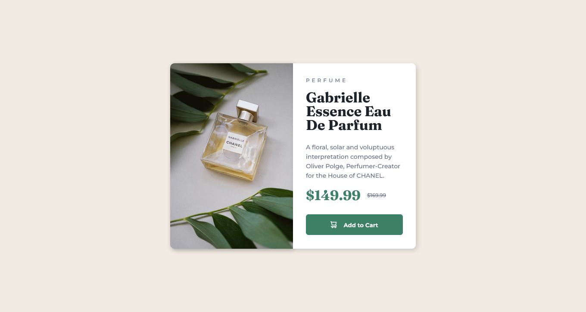

# Frontend Mentor - Product preview card component


## Welcome! 👋

Thanks for checking out this front-end coding challenge.

[Frontend Mentor](https://www.frontendmentor.io) challenges help you improve your coding skills by building realistic projects.

# Frontend Mentor - Product preview card component solution

This is a solution to the [Product preview card component challenge on Frontend Mentor](https://www.frontendmentor.io/challenges/product-preview-card-component-GO7UmttRfa). Frontend Mentor challenges help you improve your coding skills by building realistic projects. 

## Table of contents

- [Overview](#overview)
  - [The challenge](#the-challenge)
  - [Screenshot](#screenshot)
  - [Links](#links)
- [My process](#my-process)
  - [Built with](#built-with)
  - [What I learned](#what-i-learned)

## Overview

### The challenge

Users should be able to:

- View the optimal layout depending on their device's screen size
- See hover and focus states for interactive elements

### Screenshot



### Links

- Live Site URL: [https://dudusantosdev.github.io/frontend-mentor-challenges/product-preview-card-component-main/]

## My process

### Built with

- Semantic HTML5 markup
- CSS custom properties
- Flexbox
- Responsive design

### What I learned

```html
<h1>Some CSS code I'm proud of</h1>
```
```css
@media (max-width: 640px) {
    .main {
        width: 100%;
        height: 100%;
        margin-top: 5px;
        flex-direction: column;
        align-items: center;
        justify-content: center;
    }

    .content-img img {
        border-radius: 10px 10px 0px 0px;
        box-shadow: 2px 1px 15px rgba(0, 0, 0, 0.329);
    }

    .content-img picture {
        box-shadow: 10px 3px 30px rgba(0, 0, 0, 0.329);
    }

    .content {
        border-radius: 0px 0px 10px 10px;
        box-shadow: 4px 5px 10px rgba(0, 0, 0, 0.144);
        padding: 17px 20px;
        margin-bottom: 0;
    }
}
```