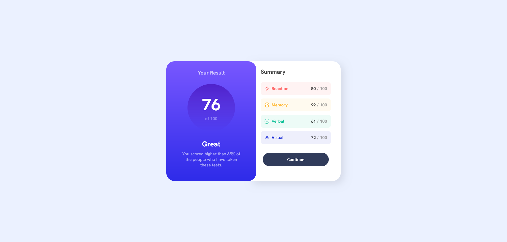

# Frontend Mentor - Results summary component solution

This is a solution to the [Results summary component challenge on Frontend Mentor](https://www.frontendmentor.io/challenges/results-summary-component-CE_K6s0maV). Frontend Mentor challenges help you improve your coding skills by building realistic projects. 

## Table of contents

- [Overview](#overview)
  - [The challenge](#the-challenge)
  - [Screenshot](#screenshot)
  - [Links](#links)
- [My process](#my-process)
  - [Built with](#built-with)
  - [What I learned](#what-i-learned)

## Overview

### The challenge

Users should be able to:

- View the optimal layout for the interface depending on their device's screen size
- See hover and focus states for all interactive elements on the page
- **Bonus**: Use the local JSON data to dynamically populate the content

### Screenshot



### Links

- Solution URL: [Add solution URL here](https://your-solution-url.com)
- Live Site URL: [Add live site URL here](https://dudusantosdev.github.io/frontend-mentor-challenges/results-summary-component-main/)

## My process

### Built with

- Semantic HTML5 markup
- CSS custom properties
- Flexbox
- CSS Grid
- Mobile-first workflow

### What I learned

```html
function renderSummary() {
    const summaryContainer = document.querySelector(".summary-content")
    const button = document.querySelector(".btn-continue")

    document.querySelectorAll(".summary-item").forEach(el => el.remove())

    data.forEach(item => {
        const summaryItem = document.createElement("div")
        summaryItem.classList.add("summary-item", item.category.toLowerCase())

        summaryItem.innerHTML = `
            <div>
                
                <span class="category">${item.category}</span>
            </div>
            <div>
                <span class="score">${item.score}</span>
                <span class="total">/ 100</span>
            </div>
        `

        summaryContainer.insertBefore(summaryItem, button)
    })
}
```